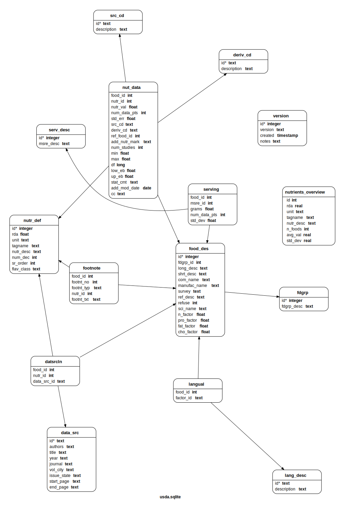

***********
 usda-sqlite
***********

.. image:: https://api.travis-ci.com/nutratech/usda-sqlite.svg?branch=master
    :target: https://travis-ci.com/github/nutratech/usda-sqlite

Python, SQL and CSV files for setting up portable usda-sqlite database.

See CLI:    https://github.com/nutratech/cli

Pypi page:  https://pypi.org/project/nutra

Building the database
#########################

1. Install ``access2csv`` dependency,

.. code-block:: bash

    git submodule update --init

2. Download government USDA databases and process into CSV files,

.. code-block:: bash

    cd data
    bash setup.sh
    python3 process.py

3. If you are committing database changes, add a line to :code:`sql/version.csv` (e.g. :code:`id=3` is the latest in this case),

+-----+----------+-----------------------------------+
| id  | version  | created                           |
+=====+==========+===================================+
| 1   | 0.0.0    | Wed 05 Aug 2020 07:09:35 PM EDT   |
+-----+----------+-----------------------------------+
| 2   | 0.0.1    | Wed 05 Aug 2020 08:14:52 PM EDT   |
+-----+----------+-----------------------------------+
| 3   | 0.0.2    | Thu 06 Aug 2020 09:21:39 AM EDT   |
+-----+----------+-----------------------------------+

4. Create the database with

.. code-block:: bash

    cd ../sql
    ./build.sh

5. Verify the tables (again inside the SQL shell :code:`sqlite3 usda.sqlite`),

.. code-block:: sql

    .tables
    SELECT * FROM nutr_def WHERE id=328;
    SELECT long_desc FROM food_des WHERE id=9050;
    SELECT * FROM version;
    .exit

6. If everything looks good, upload compressed :code:`dist/nutra-X.X.X.db.tar.xz` file to binary host (bitbucket files).

Tables (Relational Design)
##########################

See :code:`sql/tables.sql` for details.

This is frequently updated, see :code:`docs/` for more info.

